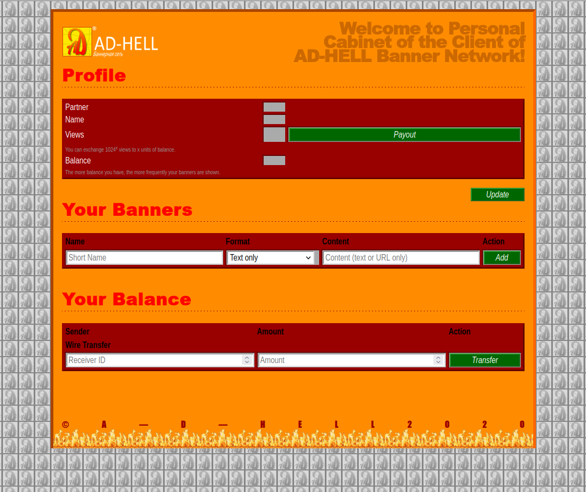

# Рекламная сеть ADHELL

Авторы: [@nsychev](https://github.com/nsychev), [@ksixty](https://github.com/ksixty)

> Постмортем будет в самом конце. Сначала мы расскажем, каким этот сервис задумывался.

Огненное продвижение вашего бизнеса.

Это — метасервис, которого нигде не было, но который был везде. Если вы пробовали подёргать сервисы вручную из браузера, рано или поздно вы могли наткнуться на интересную вещь, которой, как правило, в этом месте увидеть не ожидаешь:


Да-да, это баннерная реклама. Внимательно изучив код сервиса, во всех сервисах можно обнаружить один и тот же «бекдор»:

```html
<div id="adhellBanner"></div>
<script src="http://adhell.site/ad/renderProduction.js"></script>
```

Этот скрипт на каждый запрос отдавал некий JS, который вставляет в страницу некое значение «integrity» и, собственно, отображает сам баннер весьма странными способами:

```javascript
// That's not how JavaScript works
document.querySelector("#adhellBanner").outerHTML = document.write(`...
```

Рано или поздно нас то ли привлекали баннеры, то ли интерес узнать, зачем организаторы зарабатывают на рекламе на CTF — и мы всё же открывали `adhell.site`, чтобы посмотреть, что же это за баннерная сеть — и сразу становилось очевидно, что перед нами ещё один сервис.



Вебмастера могут пользоваться рекламным кабинетом, и на доход, полученный с показов, размещать собственную рекламу.

Быстро узнаём, что можно сделать в нашем рекламном кабинете:

1. Разместить рекламу — видим, что почему-то от нашего имени уже крутится пачка баннеров.
2. Перевести деньги другому партнёру.
3. И, самое странное — вывести деньги за просмотры. Формула расчёта нелинейная: за каждые $1024^x$ просмотров нам дают $x$ денег.

## Становимся богатыми

Если к этому моменту нам не хватает просмотров, быстро накручиваем себе 1024 (и, возможно, кому-то ещё) просмотров и получаем 1 единицу баланса.

Самый простой баг, который не требовал, собственно, взаимодействия с жюри и другими командами — перевод денег себе. Да, тут ничего абсолютно не проверялось. Можно переводить отрицательное количество денег, можно делать переводы самому себе — главное, чтобы сумма перевода была не больше баланса.

Можно было даже перевести отрицательные деньги кому-то ещё в надежде на то, что кто-то решит принять, чтобы посмотреть, что это всё вообще значит. Также можно было рейсить переводы: проверка производилась только при запросе перевода, при этом средства на счету не блокировались.

## К весёлой части

Но зачем копить деньги просто так? Смысл накопления баланса также указан в рекламном кабинете:

> The more balance you have, the more frequently your banners are shown. 

Как мы помним, вся система показа баннеров основана на исполнении произвольного JavaScript-кода в весьма странной манере. Всё, что нам осталось — найти XSS.

Искать его долго не нужно: экранирования никакого и вовсе нет. Вариантов много: можно вставить HTML-теги, а можно просто закрыть бектик и инжекнуться непосредственно в JS-код рекламно сети.

Дальше дела обстоят проще:
- можно перевести себе ещё больше денег, например, подтверждая отрицательные переводы от жюри
- можно воровать флаги со всех сервисов, натравляя эксплойт на жюри

По умолчанию у каждой команды был баланс 50, а у жюри — 2047. Таким образом, баннеры жюри показывались в среднем в 66% случаев, а баннеры команд — в оставшихся 34, причём равномерно распределённых на все команды, т.е. вероятность показа баннера была примерно 1,6%.

Важно не проиграть: согласно легенде сервиса, максимально возможный баланс — 2047. Правило обеспечивалось наиболее эффективным образом:

```python
receiver_balance %= 2048
```

## Как чинить

Самой тривиальной идеей было, конечно, просто удалить этот баннер из всех сервисов. Однако, довольно быстро сервисы падали в DOWN с ошибкой `Please disable AdBlocker`.

Оставить только значение Integrity тоже не помогло бы — на самом деле, в этой строке (что, в целом, соответствует её названию) были зашифрованы метаданные рекламы — и чекеры действительно должны были их проверять и верифицировать, что отображаемая на странице реклама соответствует требованиям рекламной сети.

Самый простой способ избавиться от XSS был такой: находим самую безобидную рекламу и просто вставляем её на страницу, избавившись от запроса к удалённому скрипту баннерной сети.

Альтернативно можно было собрать проксик для рекламных баннеров и санитизировать содержимое рекламы, поскольку валидных форматов баннеров всего три.

## Постмортем

Разумеется, всё пошло не так. Сервис ADHELL был одной из (двух) самых больших проблем на старте нашего CTF.

Из-за нехватки времени все чекеры практически до самого начала тестировались только на локальных машинах разработчиков. С учётом уже успешного опыта развёртывания полигона, мы не ожидали никаких трудностей.

Однако, экземпляр Chromium, который поставлялся с [Pyppeteer](https://github.com/pyppeteer/pyppeteer) — Python-форком известной библиотеки для автоматизации браузеров Puppeteer — попросту отказался запускаться в нашей Nix-инфраструктуре. Все наши попытки приводили к падению чекеров с кодом выхода 2.

Пострадали от этого чекеры к абсолютно всем сервисам, поскольку все они были написаны для работы в браузере — их пришлось переписывать, что вкупе с остальными факторами и привело к длительной задержке на старте.
