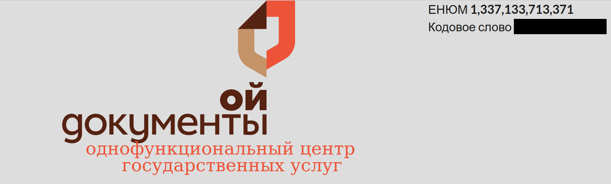
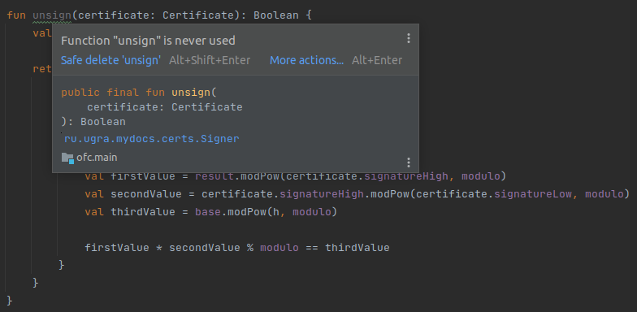

# Однофункциональный центр

Автор: [@nsychev](https://github.com/nsychev)

Данный сервис позволял быстро и удобно — а главное, безопасно — получать государственные услуги. Слово «однофункциональный», правда, означало, что сервис предоставляет ровно одну функцию.

И этой функцией был вход.

Для регистрации в сервисе нам предлагается ввести свой уникальный 13-значный Единый номер югорчанина межбанковский (ЕНЮМ) и придумать пароль. Сделав это, мы попадаем на главную страницу центра, где, во-первых, согласно всем правилам надёжной безопасности, видим свой пароль плейнтекстом — но в защищённом формате:



А, во-вторых, узнаём, что этот пароль нам больше не пригодится, поскольку вход в ОФЦ осуществляется исключительно по усиленной квалифицированной электронной цифровой подписи (УКЭЦП), которую нам и предстоит сгенерировать.

Нажимаем кнопку выпуска сертификата, придумываем пароль и... получаем текстовый файлик, содержащий одновременно наш приватный ключ и публичный ключ.

Безопасность ОФЦ находится на высочайшем уровне: на этот раз в прямо в JSON мы находим придуманный на прошлом шаге пароль.

Кнопки выхода нет, удалим cookies и попробуем залогиниться. Для этого нам понадобится некая [утилита «ШифроПро»](../../services/ofc/ofc/src/main/resources/static/shifropro.py).

Впрочем, ничего сложного в процедуре входа нет: берём токен с сайта, вводим в утилиту, получаем три значения для нашей формы.

Осталось понять, куда же приходят флаги. На самом деле, полей для ввода не так много — флагов было два типа, один из них был в пароле для входа, а второй — в пароле для сертификата.

Для эксплуатации уязвимостей нам было бы также полезно найти эндпоинт `/recent` в исходном коде — он нам позволяет ознакомиться с последними выпущенными сертификатами.

## Уязвимость 1. Мисконфигурация

Первое, на что можно обратить внимание — открытый порт Memcached в docker-compose. Давайте посмотрим, что хранится внутри:

На просторах интернета нетрудно найти утилиту, которая скачивает весь Memcached — она называется [memcached-tool](https://github.com/memcached/memcached/blob/master/scripts/memcached-tool) и доступна в самом репозитории Memcached.

Запустить её очень просто: `memcached-tool 10.2.2.1:11211 dump`. На выходе мы получаем как все объекты `Certificate`, так и все объекты `ExtendedCertificate`. Осталось получить флаги.

Флаги одного типа получаются просто поиском по полученному дампу. Получение флагов второго типа сложнее — нужно авторизоваться под пользователем. Благо, у нас всё для этого есть.

[Эксплойт](./ofc_memcached.py)

Исправить уязвимость несложно: просто убрать данный порт из пробрасываемых в `docker-compose.yml`.

## Уязвимость 2. Авторизация

В коде, который отвечает за регистрацию новых пользователей, добавлена солидная проверка на корректность и уникальность ЕНЮМа. В частности, она содержит запрос в базу данных (а именно, MongoDB) для проверки существования данного пользователя:

```kotlin
fun hasEnum(enum: String): Boolean {
    val users = storage.getCollection("users")
    if (!isEnum(enum)) throw IllegalArgumentException("enum contains not only digits")
    return users.find(where("""function() { return `$s{this.enum}` === "$enum"; }""")).count() > 0;
}
```

Внимательный читатель заметит, что при сохранении объекта в СУБД значение ЕНЮМ сохраняется как число, а при поиске совпадающих объектов запрашивается строковое значение — очевидно, что ни при какой попытке регистрации существующий пользователь не найдётся.

Таким образом, для входа от имени произвольного пользователя нам достаточно знать его ЕНЮМ и придумать любой пароль. При регистрации просто создастся ещё один юзер с тем же ЕНЮМ, а залогинимся мы в «старого» — и сможем увидеть его пароль.

[Эксплойт](./ofc_register.py)

Чтобы исправить эту уязвимость, нужно заменить поиск на нормальный. Например, так:

```kotlin
return users.find(eq("enum", enum)).count() > 0;
```

Этот способ поиска можно было подсмотреть буквально в этом же файле.

## Уязвимость 3. Do not roll your own crypto

В качестве криптографической системы для создания сертификатов использоуется [схема Эль-Гамаля](https://ru.wikipedia.org/wiki/Схема_Эль-Гамаля). Криптостойкость этой схемы приерно эквивалентна RSA при одинаковой длине ключа.

Она основывается на вычислительной сложности задачи [дискретного логарифма](https://ru.wikipedia.org/wiki/%D0%94%D0%B8%D1%81%D0%BA%D1%80%D0%B5%D1%82%D0%BD%D0%BE%D0%B5_%D0%BB%D0%BE%D0%B3%D0%B0%D1%80%D0%B8%D1%84%D0%BC%D0%B8%D1%80%D0%BE%D0%B2%D0%B0%D0%BD%D0%B8%D0%B5) — нам нужно решить уравнение

$$
y \equiv g^x \mod p
$$

Действительно, эта задача практически нерешаема для модулей порядка 2048 бит. Однако, если мы приглядимся внимательно, то все наши значения, кроме подписи сервера (`signatureHigh`, `signatureLow`) имеют довольно небольшую длину — 36 бит.

Задачу дискретного логарифмирования такого порядка можно решить даже за экспоненциальную сложность — просто перебрать все возможные значения $x$. Например, ρ-метод Полларда позволяет решить эту задачу за $\mathcal{O}(p^{1/2})$.

Что ж, всё, что нам осталось — извлечь все недавние публичные ключи, и пройти челлендж от каждого из этих юзеров. Так мы снова узнаем пароли этих пользователей.

[Эксплойт](./ofc_elgamal.py)

Чтобы исправить эту уязвимость, нужно было в методе `Challenger::newCert` заменить длину числа `prime` на что-то побольше: например, 2048. Можно было «усилить» и `challenge` — но совершенно необязательно.

## Уязвимость 4. Ненадёжная инфраструктура публичных ключей

При авторизации в ОФЦ пользователь должен был предоставить свой публичный ключ — он содержал ЕНЮМ в качестве обычного текстового поля, — и челлендж, который нужно было пройти с помощью собственного приватного ключа.

Верифицировать, что пользователь действительно обладает приватным ключом, довольно легко — достаточно проверить челлендж. Однако, этого недостаточно: нужно ещё проверить, действительно ли это приватный ключ нужного нам пользователя.

За это отвечает функция `Signer::unsign`. При сборке контейнера единожды генерируется приватный ключ сервера, которым подписываются все публичные ключи пользователей при генерации. Эта подпись хранится в полях `high` и `low`. На первый взгляд функция выглядит довольно надёжно — весь процесс проверки подписи реализован ровно так, как и должен быть. Но, как и всегда, есть небольшой нюанс:



Да, действительно, подпись просто не проверялась. Мы могли зайти в профиль любого пользователя, просто используя нашу ключевую пару (даже не обязательно с нашего сервера), заменив в ней поле, отвечающее за ЕНЮМ.

[Эксплойт](ofc_unsigned.py)

Над исправлением этой уязвимости также долго думать не нужно: функция `unsign` уже написана, достаточно просто её использовать при проверке полученной подписи.
